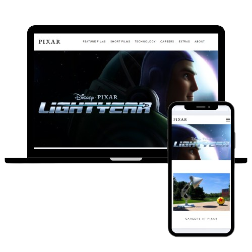

<h2 align="center">
  Replica de Pixar.com 
  <a href="https://cristiancgutierrezg.github.io/Pixar-Page-copy/" target="_blank">Pixar-Page-Copy</a>
</h2>

  

Replica del Home de la pagina web <a href="https://www.pixar.com" target="_blank">www.pixar.com</a> 

## 🛠 Desarrollado con

Este proyecto fue hecho con las siguientes tecnologias 

- HTML5
- SASS
- JavaScript 
- VsCode

## Caracteristicas

**🎨 Diseñado con SASS y metodologia BEM**

**📱 Totalmente Responsive**

**📑 Practica de tecnologias Vanilla js y libreria <a href="https://basicscroll.electerious.com/" target="_blank">basicscroll</a>**

